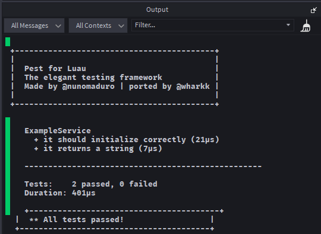

# 🧪 Pest for Luau

**The elegant testing framework for Roblox development.**



A Luau port of [PestPHP](https://pestphp.com/) by [@nunomaduro](https://github.com/nunomaduro), bringing beautiful test syntax and Test-Driven Development practices to the Roblox ecosystem.

---

## About

Automated testing shouldn't feel like a chore. Pest makes Test-Driven Development natural and enjoyable with expressive syntax, comprehensive matchers, and test organization that reads like documentation. Whether you're building your first test suite or scaling an existing one, Pest gives you the tools to ship with confidence.

---

## Why Choose Pest?

### Beautiful Syntax

Pest gives you expressive, readable tests that communicate intent clearly:
```lua
describe("Player Inventory", function()
    it("adds items correctly", function()
        expect(inventory).toContain("Sword")
    end)
    
    it("prevents duplicate items", function()
        inventory:AddItem("Shield")
        expect(inventory.Items).toHaveLength(1)
    end)
    
    it("validates item types", function()
        expect(function() 
            inventory:AddItem(123) 
        end).toThrow("Invalid item type")
    end)
end)
```

### Comprehensive Matchers

50+ built-in assertions covering everything from basic equality to Roblox-specific features:

**Equality & Types:**
```lua
expect(value).toBe(5)
expect(value).toEqual({a = 1, b = 2})
expect(value).toBeA("string")
```

**Numbers:**
```lua
expect(health).toBeGreaterThan(0)
expect(damage).toBeBetween(10, 20)
expect(multiplier).toBeCloseTo(1.5, 2)
```

**Strings:**
```lua
expect(username).toStartWith("Player")
expect(message).toContainString("error")
expect(code).toMatch("^%d+$")
```

**Tables & Arrays:**
```lua
expect(items).toContain("Sword")
expect(data).toHaveKey("userId", 12345)
expect(inventory).toMatchObject({gold = 100})
```

**Roblox-Specific:**
```lua
expect(workspace.Part).toBeInstanceOf("BasePart")
expect(player).toHaveAttribute("Level", 5)
expect(gui).toBeDescendantOf(PlayerGui)
```

### Chainable Assertions

Build expressive, self-documenting tests with method chaining:
```lua
expect(player.Level)
    :toBeGreaterThan(0)
    :toBeLessThanOrEqual(100)
    :toBeInteger()
```

Negation is simple and readable:
```lua
expect(value).not_().toBeNil()
expect(array).never().toBeEmpty()
```

### Production-Grade Features

**Lifecycle Hooks:**
```lua
describe("PlayerData", function()
    beforeEach(function()
        -- Setup test data
    end)
    
    afterEach(function()
        -- Cleanup
    end)
    
    it("persists changes", function()
        -- Test implementation
    end)
end)
```

**Test Modifiers:**
```lua
it.skip("not ready yet", function() end)
it.only("debug this specific test", function() end)
it.todo("implement player trading")
```

**Data-Driven Testing:**
```lua
local datasets = {
    {input = 5, expected = 10},
    {input = 10, expected = 20},
    {input = 15, expected = 30}
}

it.each(datasets)("doubles the input", function(data)
    expect(double(data.input)).toBe(data.expected)
end)
```

### Extensible

Add custom matchers for domain-specific assertions:
```lua
Pest.extendExpect("toBeValidPlayer", function(expectation, minLevel)
    local player = expectation.value
    local hasLevel = player:GetAttribute("Level") >= minLevel
    local hasUserId = player.UserId > 0
    
    assert_(expectation, hasLevel and hasUserId,
        `Expected valid player with level >= {minLevel}`,
        `Expected invalid player`)
end)

-- Use your custom matcher
expect(player).toBeValidPlayer(5)
```

---

### Option 1: GitHub Download (Recommended)

Get the latest version here: [PestLuau](./PestLuau.luau)

### Option 2: Roblox Creator Store Download

1. Download the framework from the [Roblox Creator Store](https://create.roblox.com/store/asset/78225332952516/PestLuau)
2. Import into Roblox Studio
3. Place in `ReplicatedStorage` or where your store you libraries

---

## Quick Start

### Basic Test Structure
```lua
local Pest = require(ReplicatedStorage.Pest)
local test, it, describe, expect = Pest.test, Pest.it, Pest.describe, Pest.expect

describe("Calculator", function()
    it("adds two numbers", function()
        expect(2 + 2).toBe(4)
    end)
    
    it("subtracts numbers", function()
        expect(10 - 5).toBe(5)
    end)
end)

-- Run all tests
Pest.run()
```

### Testing a Service
```lua
local MyService = require(ServerScriptService.Services.MyService)

describe("MyService", function()
    beforeEach(function()
        MyService:Reset()
    end)
    
    it("initializes with default state", function()
        expect(MyService.State).toEqual({
            active = false,
            count = 0
        })
    end)
    
    it("increments count correctly", function()
        MyService:Increment()
        expect(MyService.State.count).toBe(1)
    end)
end)
```

### Testing Roblox Instances
```lua
describe("GUI Hierarchy", function()
    it("creates proper structure", function()
        local screenGui = Instance.new("ScreenGui")
        local frame = Instance.new("Frame")
        frame.Parent = screenGui
        
        expect(frame).toBeInstanceOf("GuiObject")
        expect(frame).toBeDescendantOf(screenGui)
        expect(screenGui:FindFirstChild("Frame")).toBe(frame)
    end)
end)
```

---

## Configuration

Customize Pest's behavior:
```lua
Pest.configure({
    stopOnFirstFailure = false,  -- Stop at first failed test
    verbose = true,              -- Show detailed output
    colors = false,              -- Enable ANSI colors (Studio doesn't support this)
    timeout = 5                  -- Default timeout per test (seconds)
})
```

---

## Output Format

Pest provides clean, hierarchical test output:
```
 +------------------------------------------+
 |                                          |
 |  Pest for Luau                           |
 |  The elegant testing framework           |
 |	Made by @nunomaduro | ported by @wharkk |
 |                                          |
 +------------------------------------------+

  Calculator
    + it adds two numbers (7µs)
    + it subtracts numbers (5µs)

  PlayerData
    + it persists changes (21µs)
    + it handles corruption (15µs)

  --------------------------------------------------

  Tests:    4 passed, 0 failed
  Duration: 401µs

  +----------------------------------------+
  |  ** All tests passed!                  |
  +----------------------------------------+
```

---

## Real-World Usage

Pest is currently used in production for:

- **[Titanium Framework](https://github.com/Wharkk/titanium)** - Comprehensive test coverage for data services, monetization, and analytics
- **Service Validation** - Testing initialization order, dependency injection, lifecycle hooks
- **Data Migrations** - Ensuring schema changes preserve player data integrity
- **Regression Testing** - Catching breaking changes before deployment

---

## API Reference

For a complete list of matchers and methods, see [API Documentation](docs/API.md) *(coming soon)*

**Matcher Categories:**
- Equality: `toBe`, `toEqual`, `toStrictEqual`
- Truthiness: `toBeTruthy`, `toBeFalsy`, `toBeNil`, `toBeDefined`
- Numbers: `toBeGreaterThan`, `toBeLessThan`, `toBeCloseTo`, `toBeBetween`, `toBePositive`, `toBeNegative`
- Strings: `toStartWith`, `toEndWith`, `toContainString`, `toMatch`, `toBeUpperCase`, `toBeLowerCase`
- Tables: `toContain`, `toContainEqual`, `toHaveKey`, `toMatchObject`, `toBeArray`, `toBeEmpty`
- Functions: `toThrow`, `toThrowError`
- Roblox: `toBeInstanceOf`, `toBeDescendantOf`, `toHaveProperty`, `toHaveAttribute`

---

## Roadmap

- [ ] CLI test runner for non-runtime execution
- [ ] Code coverage reporting
- [ ] Snapshot testing
- [ ] Parallel test execution
- [ ] Integration with CI/CD pipelines

---

## Contributing

Contributions welcome! Feel free to:
- Report bugs via [Issues](https://github.com/Wharkk/pest-luau/issues)
- Submit pull requests
- Request new matchers or features

---

## License

MIT License - See [LICENSE](LICENSE) for details

---

## Credits

**Original Concept:** [PestPHP](https://pestphp.com/) by [@nunomaduro](https://github.com/nunomaduro)

**Luau Port:** **wharkk** ([@wharkk_](https://discord.com/users/629991962522681365))

**Portfolio**: [wharkk-developer.framer.website](https://wharkk-developer.framer.website)

Special thanks to Nuno Maduro for creating PestPHP and inspiring this port. Pest's elegant approach to testing deserved to exist in the Roblox ecosystem.
